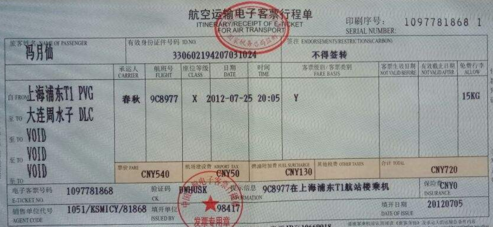

[简体中文](README.md) | English
# Swin-unet (Swin Transformer Unet) is used to identify the document table structure 
 
## function   
- [x] Identify the lines in the doc table
- [ ] Convert results to excel

## download the weights model file   
Model file address：https://pan.baidu.com/s/1K2bxqqmZaOtPI1jeWN3Ygg 

password：w0yj

Copy the model.h5 to the model directory

## training（tensorflow2.5）     
See train.py in this project    

## prediction
See table_line_infer.py in this project

## identification result presentation
 
### table line detection
 

 
### table line detection
 

 
### table line detection
 

 
### table line detection
 

 
### table line detection

 
### table line detection
    

## contact

1、github：https://github.com/jiangnanboy

2、blog：https://www.cnblogs.com/little-horse/

3、QQ:2229029156
   
