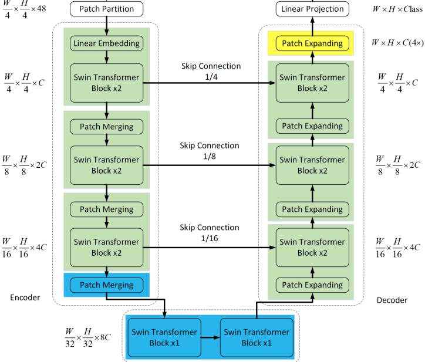
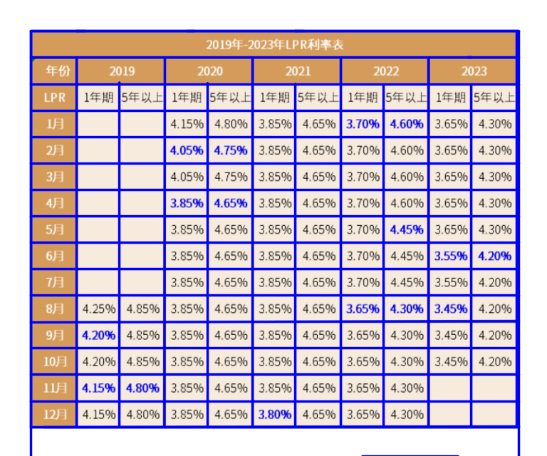
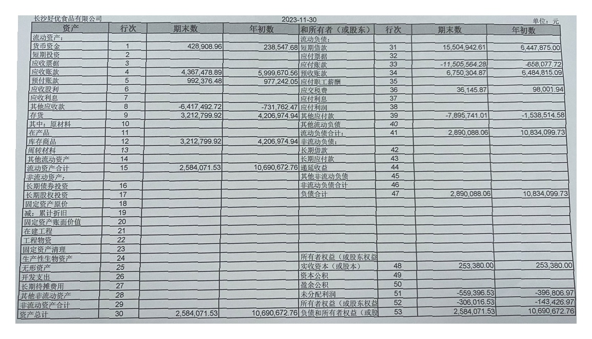
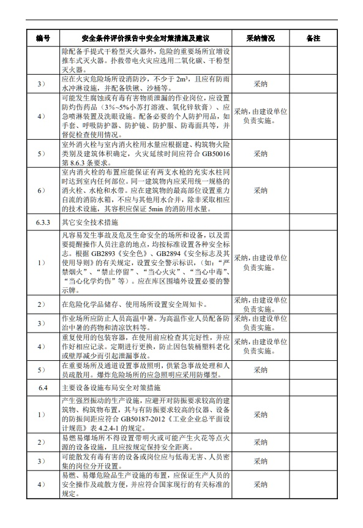
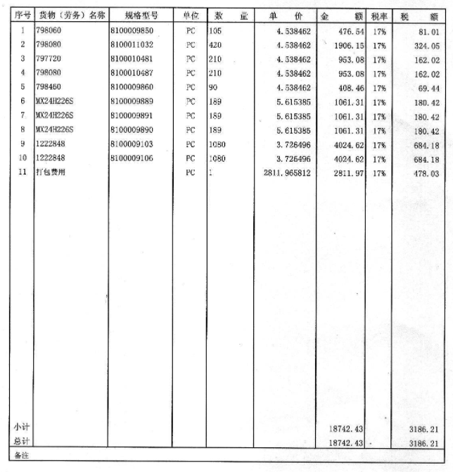
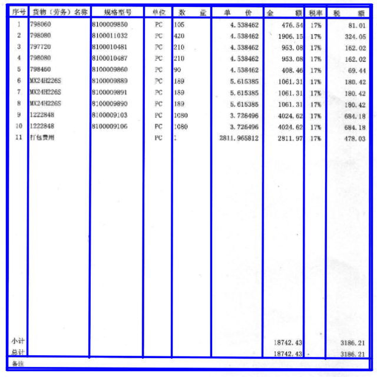

[English](README.en.md) | 简体中文
# 利用Swin-Unet(Swin Transformer Unet)实现对文档图片里表格结构的识别 
 
## 实现功能   
- [x] 识别表格中的线条
- [ ] 结果转为excel

## 下载weights模型文件   
模型文件地址: 链接：https://pan.baidu.com/s/1K2bxqqmZaOtPI1jeWN3Ygg 

提取码：w0yj

拷贝model.h5文件到model目录下

## 训练（tensorflow2.5版本训练）     
见本项目中的train.py    

## 预测
见本项目中的table_line_infer.py

## 识别结果展示
 
### 表格线检测
 

 
### 表格线检测
 

 
### 表格线检测
 

 
### 表格线检测
 

 
### 表格线检测

 
### 表格线检测
    

## contact

1、github：https://github.com/jiangnanboy

2、blog：https://www.cnblogs.com/little-horse/

3、QQ:2229029156
   
